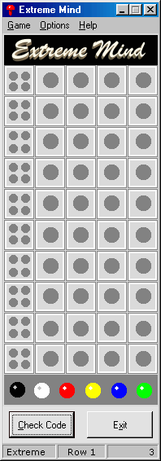



## Extreme Mind 1\.0

### Description

Extreme Mind is a game where the user tries to figure out a random code created by the computer. This board game is based on a game I played as a child called Mastermind. I have seen a couple attempts to re-create this game (on PSC) for the computer but I personally didn't like any of the ones I found, so I wrote my own, and I give it to you.

Please, Please, Please Vote and leave as many comments as possible because I have only been programming since March 2001 and using VB since July 2001, so the more comments the better.

Some interesting things in this code are: 

-Generating random numbers with no duplicates 

-Scanning the user's code for duplicates 

-Using Random Access Data Files 

-Remembering settings 

-Checking the user's code (pretty involved) 

-Image swapping 

-Using Sounds 

-Sending an .html file to the default browser 

And much much more...
 
### More Info
 

             |
---                |---
**Submitted On**   |2001-09-17 19:21:16
**By**             |[John Flynn](https://github.com/Planet-Source-Code/PSCIndex/blob/master/ByAuthor/john-flynn.md)
**Level**          |Beginner
**User Rating**    |5.0 (30 globes from 6 users)
**Compatibility**  |VB 6\.0
**Category**       |[Complete Applications](https://github.com/Planet-Source-Code/PSCIndex/blob/master/ByCategory/complete-applications__1-27.md)
**World**          |[Visual Basic](https://github.com/Planet-Source-Code/PSCIndex/blob/master/ByWorld/visual-basic.md)
**Archive File**   |[Extreme Mi266569182001\.zip](https://github.com/Planet-Source-Code/john-flynn-extreme-mind-1-0__1-27372/archive/master.zip)

